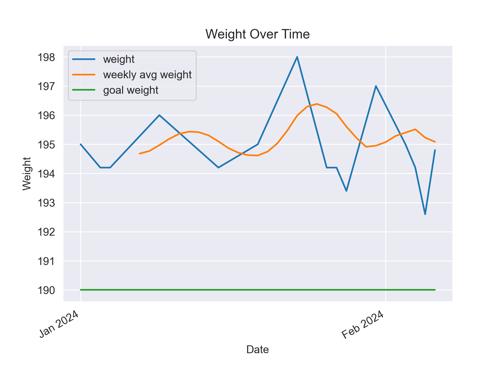
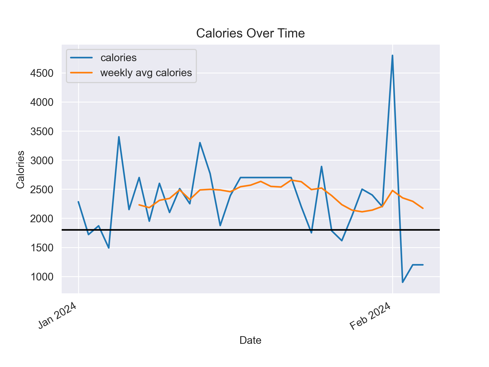

# WeightTracker
This repo tracks my weight and calories. I record my weight and calories in a Google Sheet every day. I then use the Google Cloud API to pull the data into a dataframe and create the charts below

# Weight

# Calories

